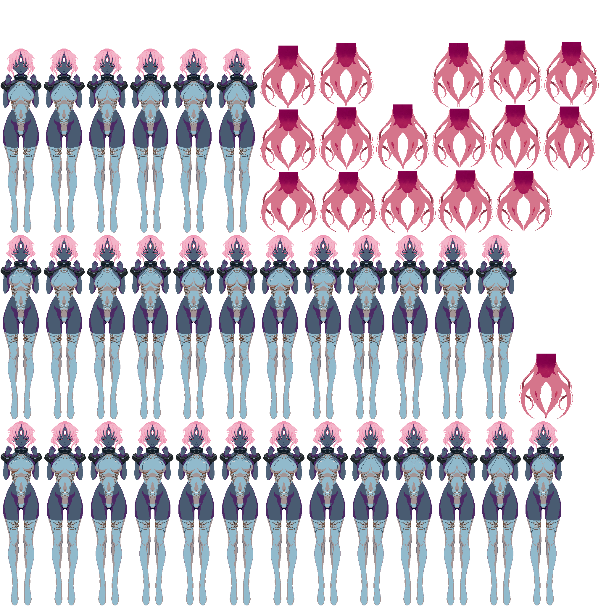
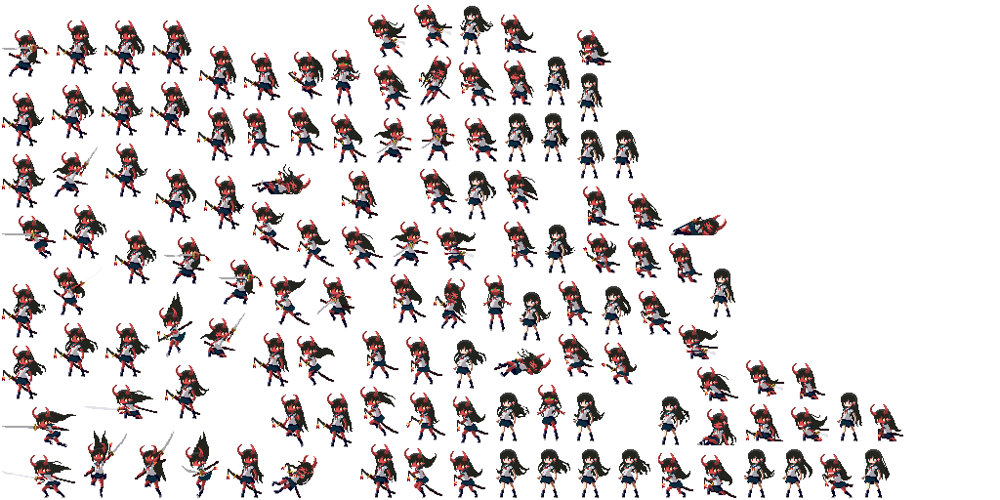
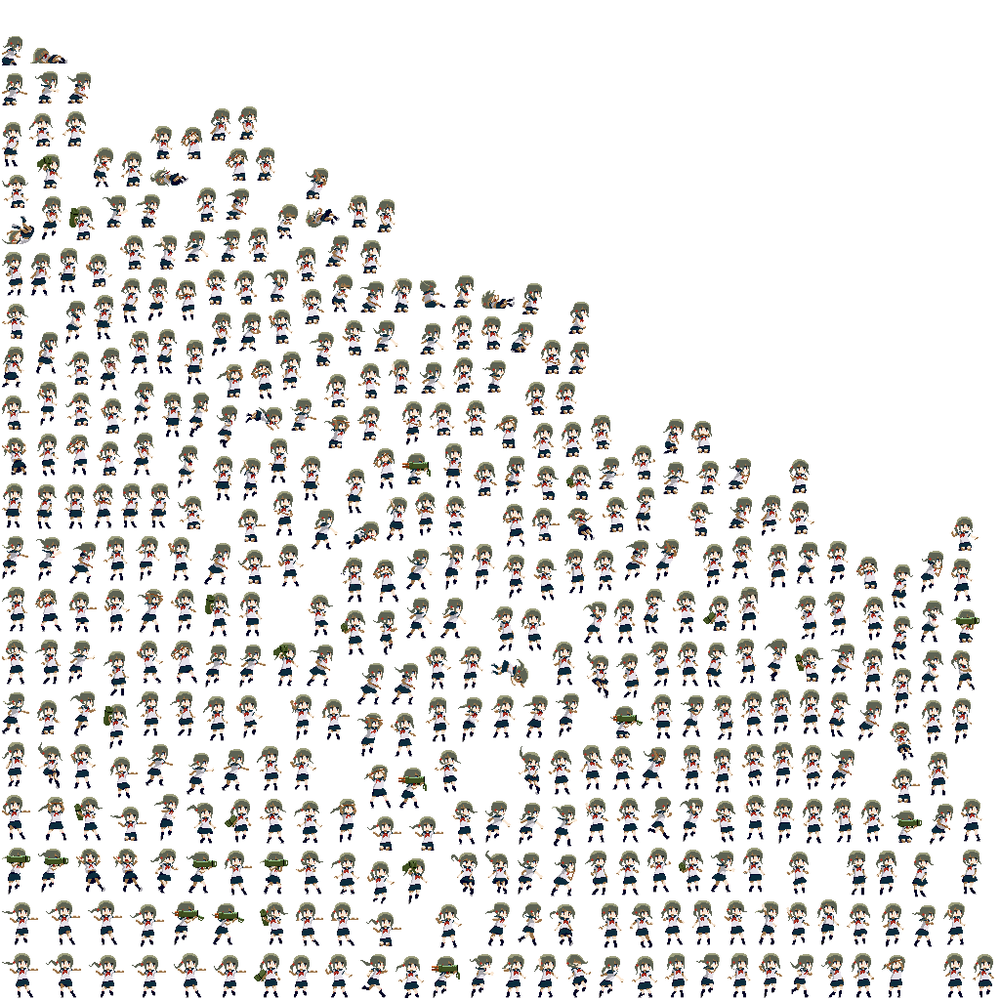

# Execution Result

## Edge Detect

1. [multiple_test0.png](../tests/assets/multiple_test0.png)
   origin:
   
   after process:
   
2. [multiple_test1.png](../tests/assets/multiple_test1.png)
   origin:
   
   after process:
   
3. [multiple_test2.png](../tests/assets/multiple_test2.png)
   origin:
   
   after process:
   
4. [tmp.png](../tests/assets/tmp.png)
   origin:
   
   after process:
   

## Sprite Scan

1. [multiple_test0.png](../tests/assets/multiple_test0.png)
   origin:
   
   after process:
   
2. [multiple_test1.png](../tests/assets/multiple_test1.png)
   origin:
   
   after process:
   
3. [multiple_test2.png](../tests/assets/multiple_test2.png)
   origin:
   
   after process:
   
4. [tmp.png](../tests/assets/tmp.png)
   origin:
   
   after process:
   
